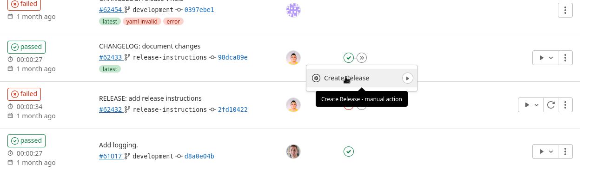
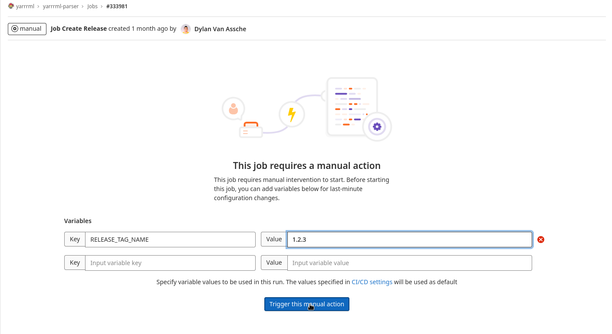

# Releases

1. Open the list of CI/CD pipelines here: https://gitlab.ilabt.imec.be/yarrrml/yarrrml-parser/-/pipelines/
2. Under the stages column, pick the latest pipeline and click on '>>'.
3. A tab will under '>>' will be shown with 'Create Release', click on it (not on the play button)

5. A new page is shown with a Key-Value entry box. Enter the following:
  - Key: `RELEASE_TAG_NAME`
  - Value: `1.2.3` (for releasing v1.2.3)
6. Press the 'Trigger this action manually' button

